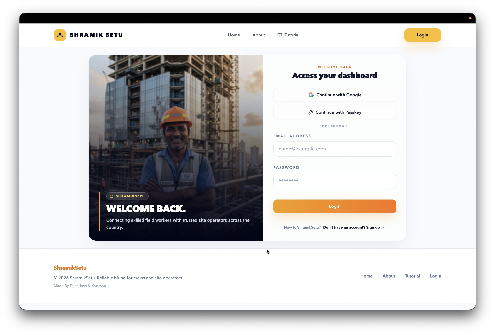
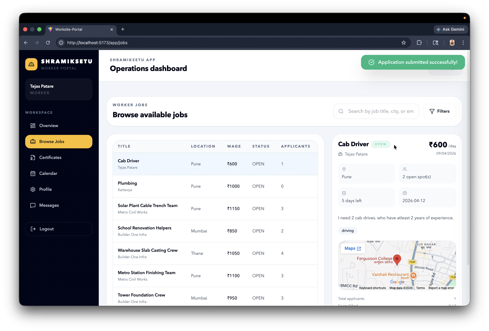
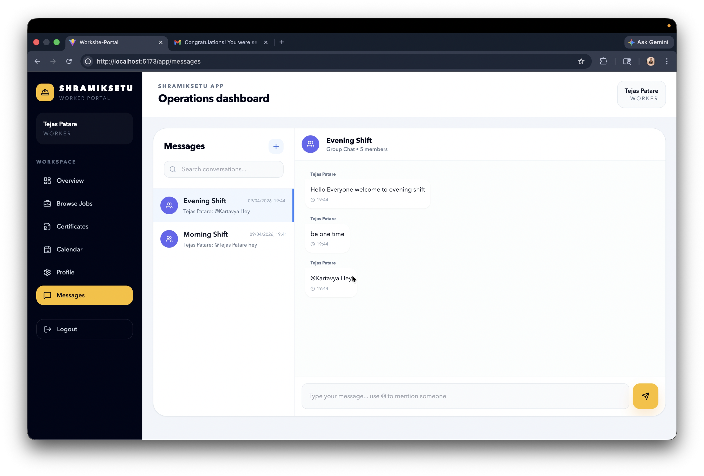

# WorkSite - Construction Workforce Job Portal Backend

A Django REST Framework backend for a construction workforce job portal featuring secure authentication, role-based access control, job management, attendance tracking, and worker-employer collaboration.

---

## Overview

WorkSite is a backend system designed to simplify workforce management in the construction industry.

The platform allows employers to create and manage jobs, while workers can apply for jobs, track attendance, manage availability, and review completed work.

This project helped me explore real-world backend development concepts such as authentication systems, scalable API design, atomic database operations, and role-based access control using Django REST Framework.

---

## Features

### Authentication & Security
- Email and password authentication
- Google OAuth 2.0 login
- WebAuthn Passkey authentication
- Session-based authentication
- Role-based access control

### User Roles
- Worker
- Employer
- Admin

### Job Management
- Create and manage job postings
- Apply for jobs
- Manage worker applications
- Automatic slot filling and job closure
- Job filtering by:
  - city
  - wage range
  - skills
  - site location

### Worker Features
- Task history tracking
- Attendance records
- Calendar availability management
- Co-worker details
- Review and rating system

### Employer Features
- Attendance management
- Worker application handling
- Dashboard summary metrics
- Job completion tracking

### Additional Features
- Swagger API documentation
- Atomic database operations
- Verification document support
- Location coordinates for job sites
- Admin management panel

---

## Tech Stack

### Backend
- Django
- Django REST Framework

### Database
- PostgreSQL
- SQLite (Development)

### Authentication
- Google OAuth 2.0
- WebAuthn Passkeys

### Documentation
- drf-spectacular
- Swagger/OpenAPI

---

## Project Structure

```text
worksite/
├── authentication/
├── jobs/
├── applications/
├── attendance/
├── reviews/
├── calendar/
├── dashboard/
└── manage.py
```

---

## Screenshots

### Landing Page


### Login Page


### Dashboard


### Chat


---

## API Features

### Authentication APIs
- Register/Login
- Google OAuth
- Passkey registration & login
- Profile management

### Job APIs
- Create jobs
- Apply for jobs
- Update application status
- Attendance tracking
- Job completion

### Dashboard APIs
- Worker summary
- Employer summary
- Task history
- Calendar management

---

## Atomic Operations

To prevent race conditions during job applications, atomic database operations were implemented using:

- `select_for_update()`
- Django `F()` expressions

This ensures:
- Accurate slot filling
- Safe concurrent applications
- Automatic job closure when worker limits are reached

---

## Challenges I Faced

One of the biggest challenges was implementing multiple authentication methods while maintaining proper session handling and role-based access control.

Managing atomic operations for job applications was also an important learning experience because multiple workers could apply simultaneously for limited slots.

I also learned how to structure a larger Django backend project with multiple interconnected modules and APIs.

---

## What I Learned

- Django REST Framework architecture
- API design and documentation
- Role-based authentication systems
- Google OAuth integration
- WebAuthn Passkey implementation
- Atomic database operations
- PostgreSQL integration
- Scalable backend structure
- Real-world API workflow design

---

## Installation

### Clone Repository

```bash
git clone <repo-url>
cd worksite
```

### Create Virtual Environment

```bash
python -m venv venv
source venv/bin/activate
```

### Install Dependencies

```bash
pip install -r requirements.txt
```

### Run Migrations

```bash
python manage.py makemigrations
python manage.py migrate
```

### Create Superuser

```bash
python manage.py createsuperuser
```

### Start Development Server

```bash
python manage.py runserver
```

---

## API Documentation

Swagger UI:

```text
http://localhost:8000/api/docs/
```

---

## Future Improvements

- Real-time notifications
- Chat system
- Job recommendation system
- Docker deployment
- CI/CD integration

---

## Contributors

- Tejas Patare
- Isha Vaidya
- Kartavya Gore
